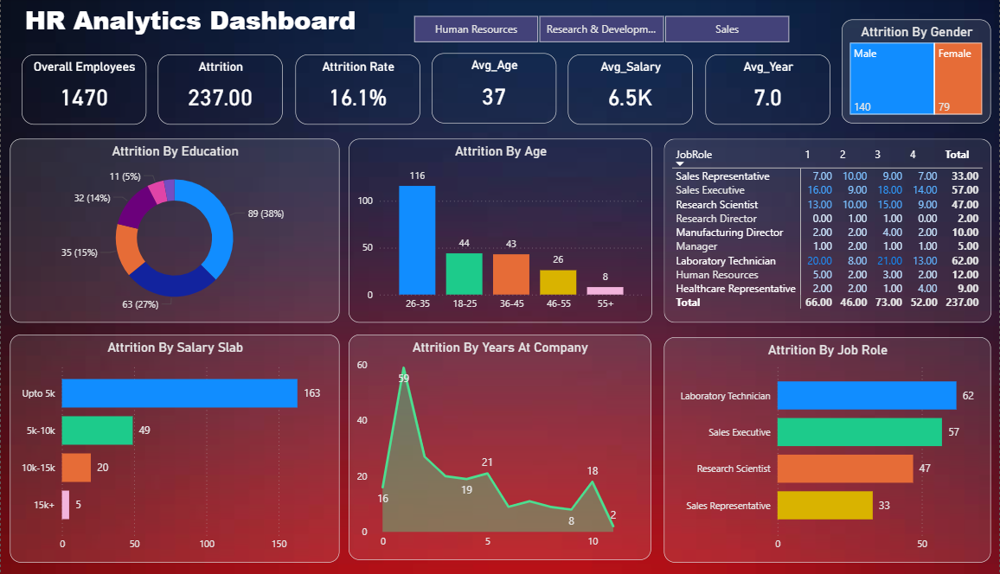

# HR Analytics Dashboard

## 📌 Project Overview
This project is an interactive HR Analytics Dashboard developed using Power BI to analyze employee attrition and workforce trends.

## 🛠 Tools Used
- Power BI
- Excel
- DAX
- Power Query

## 📊 Key KPIs
- Total Employees: 1470
- Attrition Count: 237
- Attrition Rate: 16.1%
- Average Age: 37
- Average Salary: 6.5K
- Average Years at Company: 7.0

## 📈 Dashboard Insights
- Employees aged 26–35 have the highest attrition.
- Employees earning up to 5K salary show the highest turnover.
- Laboratory Technicians and Sales Executives have the most attrition.
- Attrition varies across education levels and departments.

## 🖼 Dashboard Screenshot

## 📂 Files Included
- HR_Analytics_Dashboard.pbix
- HR_Data.xlsx
- HR_Analytics_Dashboard.png
- README.md

## 🚀 How to Use
1. Download the `.pbix` file.
2. Open it in Power BI Desktop.
3. Explore the dashboard using filters and slicers.
